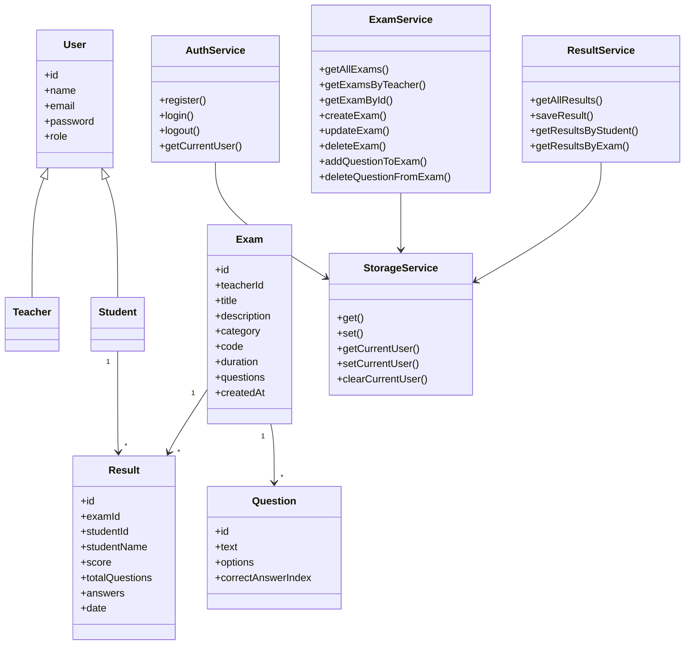

# Client Side Exam System

## Project Description

This project is a client-side exam management system built for a Web Development course.

The system works only in the browser and does not use a backend server.  
All data is saved using `localStorage`.

The project uses:

- HTML5
- CSS3
- JavaScript
- ES Modules
- OOP Classes
- JSON
- localStorage

---

## Student Details

Name: mohamed diab  
ID: 213018328
GitHub Source Code: https://github.com/Mhmdfff/client-side-exam-system  
GitHub Pages Website: https://mhmdfff.github.io/client-side-exam-system/
---

## User Roles

The system has two types of users:

### Teacher

The teacher can:

- Register
- Login
- Create exams
- Edit exam information
- Delete exams
- Add questions to exams
- Delete questions
- View exams created by him
- View student results

### Student

The student can:

- Register
- Login
- Search exams by name, code, or category
- Take exams
- Submit answers
- See score immediately
- View exam history
- View average grade

---

## Main Features

### Authentication

Users can create an account and choose their role:

- Teacher
- Student

After login, the user is redirected to the correct dashboard according to the role.

### Exam Management

Teachers can create exams with:

- Exam ID
- Title
- Description
- Category
- Exam code
- Duration
- Questions

### Question Management

Each question contains:

- Question text
- Four answer options
- Correct answer

### Student Exam System

Students can search exams and take them.  
After submitting the exam, the system calculates the grade automatically.

### Timer

Each exam has a countdown timer based on the exam duration.  
When the time ends, the exam is submitted automatically.

### Results

Results are saved in localStorage.  
Students can see their previous grades and average grade.  
Teachers can see student results for each exam.

---

## Technologies Used

| Technology | Usage |
|---|---|
| HTML5 | Page structure |
| CSS3 | Styling |
| JavaScript | Logic |
| ES Modules | Splitting code into files |
| OOP Classes | User, Teacher, Student, Exam, Question, Result |
| JSON | Saving and loading data |
| localStorage | Client-side database |

---

## Deployment

Source Code Repository:  
https://github.com/Mhmdfff/client-side-exam-system

GitHub Pages Website:  
https://mhmdfff.github.io/client-side-exam-system/

The project is deployed using GitHub Pages.

Deployment steps:

1. Push the project to GitHub.
2. Open repository Settings.
3. Go to Pages.
4. Choose Deploy from a branch.
5. Select main branch and root folder.
6. Save and wait until GitHub creates the website link.

---

## File Structure

```text
client-side-exam-system/
│
├── index.html
├── register.html
├── login.html
├── teacher-dashboard.html
├── exam-details.html
├── student-dashboard.html
├── search-exam.html
├── take-exam.html
├── README.md
│
├── css/
│   └── style.css
│
└── js/
    ├── app.js
    ├── auth.js
    ├── teacherDashboard.js
    ├── examDetails.js
    ├── studentDashboard.js
    ├── searchExam.js
    ├── takeExam.js
    │
    ├── models/
    │   ├── User.js
    │   ├── Teacher.js
    │   ├── Student.js
    │   ├── Exam.js
    │   ├── Question.js
    │   └── Result.js
    │
    └── services/
        ├── StorageService.js
        ├── AuthService.js
        ├── ExamService.js
        └── ResultService.js
```

---

## Pages and Roles Flow

### Main Page - index.html

The user enters the system from the main page.  
The page includes student name, ID, GitHub link, register link and login link.

### Register Page - register.html

A new user creates an account.  
The user chooses a role:

- Teacher
- Student

The data is saved in localStorage under the key `users`.

### Login Page - login.html

The user logs in using email and password.

After successful login:

- Teacher is redirected to `teacher-dashboard.html`
- Student is redirected to `student-dashboard.html`

The current user is saved in localStorage under the key `currentUser`.

### Teacher Flow

1. Teacher logs in.
2. Teacher enters `teacher-dashboard.html`.
3. Teacher creates a new exam.
4. Exam is saved in localStorage under the key `exams`.
5. Teacher opens `exam-details.html`.
6. Teacher adds questions and correct answers.
7. Teacher can edit exam information.
8. Teacher can delete questions.
9. Teacher can see student results for this exam.

### Student Flow

1. Student logs in.
2. Student enters `student-dashboard.html`.
3. Student goes to `search-exam.html`.
4. Student searches exam by name, code or category.
5. Student opens `take-exam.html`.
6. Student answers the questions.
7. The system calculates the grade.
8. The result is saved in localStorage under the key `results`.
9. Student can see exam history and average grade.
10. Teacher can see the student's result in `exam-details.html`.

---

## JSON Data Format

The system saves all data in localStorage as JSON strings.

### users

```json
[
  {
    "id": "123456",
    "name": "Teacher",
    "email": "teacher@test.com",
    "password": "1234",
    "role": "teacher"
  },
  {
    "id": "999999",
    "name": "Student",
    "email": "student@test.com",
    "password": "1234",
    "role": "student"
  }
]
```

### currentUser

```json
{
  "id": "999999",
  "name": "Student",
  "email": "student@test.com",
  "password": "1234",
  "role": "student"
}
```

### exams

```json
[
  {
    "id": "111",
    "teacherId": "123456",
    "title": "world cup winner",
    "description": "the winner of the last world cup",
    "category": "football",
    "code": "muller",
    "duration": 1,
    "questions": [
      {
        "id": "222",
        "text": "Who won the last world cup?",
        "options": [
          "Argentina",
          "France",
          "Brazil",
          "Germany"
        ],
        "correctAnswerIndex": 0
      }
    ],
    "createdAt": "2026-07-07T20:00:00.000Z"
  }
]
```

### results

```json
[
  {
    "id": "333",
    "examId": "111",
    "studentId": "999999",
    "studentName": "Student",
    "score": 100,
    "totalQuestions": 1,
    "answers": [
      {
        "questionId": "222",
        "questionText": "What is JavaScript?",
        "selectedAnswerIndex": 0,
        "correctAnswerIndex": 0,
        "isCorrect": true
      }
    ],
    "date": "7.7.2026, 22:51:18"
  }
]
```

---

## localStorage Keys

The project saves data in localStorage using these keys:

```text
users
currentUser
exams
results
```

---

## OOP Diagram



---

## How to Run the Project

Open the project using Visual Studio Code.

Install the Live Server extension.

Right click on:

```text
index.html
```

Then choose:

```text
Open with Live Server
```

The project must be opened with Live Server because it uses ES Modules.

---

## Test Users

You can create users manually from the register page.

Example teacher:

```text
Name: Teacher
Email: teacher@test.com
Password: 1234
Role: Teacher
```

Example student:

```text
Name: Student
Email: student@test.com
Password: 1234
Role: Student
```

---

## Git Commits

The project was developed step by step using Git commits.

Commit steps:

```text
Initial project structure and teacher exam creation dashboard
Add exam details page and question management
Add student exam search page
Add take exam page and save student results
Add student exam history and average grade
Add teacher view of student exam results
Add exam timer with automatic submit
Add README and OOP diagram
Update README with GitHub link
```

---

## Summary

This project demonstrates a full client-side exam system using ES Modules, OOP Classes, JSON and localStorage.

The project includes teacher and student roles, exam creation, question management, exam search, exam execution, automatic grading, timer, student history, average grades and teacher result view.